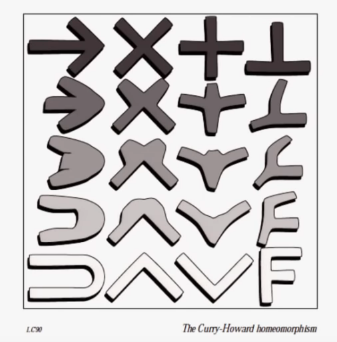

# Philip Wadler - "Propositions as types"
[source](https://www.youtube.com/watch?v=IOiZatlZtGU)

## Natural deduction

- If A implies B and B is known then you know A.
- Assume A is true, and from that you prove B, if A is true then B is true.
- If you prove A&B, you can conclude A and you can conclude B.
- If you can prove A and independently prove B, then you've proven A&B.
```
[A]x...B                  A ⊃ B     A
-------- (⊃-Ix)          ------------- (⊃-E)
 A ⊃ B                        B

A    B           A & B             A & B
------ (&-I)    ------- (&-E0)    ------- (&-E1)
A & B              A                 B
```
E - stands for elimination, I - stands for introduction

Proof that B&A -> A&B
```
B & A      B & A
-----      -----
  A          B
----------------
      A & B
 --------------
 B & A -> A & B
```

## Simply type lambda calculus

```
(Abstraction)                 (Application)

[A]x:A...N:B                 L:A⊃B     M:A
------------ (⊃-Ix)          ------------- (⊃-E)
 \x.N:A⊃B                        L M:B

  (Pair)              (First)            (Second)

M:A   N:B             L:A&B               L:A&B
---------- (&-I)    --------- (&-E0)    --------- (&-E1)
(M, N):A&B          (fst L):A           (snd L):B
```

## Discussion

Evaluation corresponds to simplification of proofs.
"The halting problem" cannot be solved, it's undecidable.
If your algorithm is typed and you are not using the fix-point operator
(or unlimited general recursion), you are guaranteed that it terminates.

If you are not using the fix-point operator, you get theorem provers like Coq and Agda,
where you don't have the halting problem but you can't do everything a Turing machine can do.

Q: What can't you do?

## Curry-Howard equivalence/isomorphism: for every proposition you can associate a type.

+--------------------------+------------------------+
| mathematical logic       | programming languages  |
+--------------------------+------------------------+
| propositions             | types                  |
+--------------------------+------------------------+
| proofs                   | terms (programs)       |
+--------------------------+------------------------+
| simplification of proofs | evaluation of programs |
+--------------------------+------------------------+

- The correspondence between types and formulas of logic:

```
->  ::  ⊃
x   ::  AND
+   ::  OR
⊥   ::  False formula
```

Product types == records == structs (carthesian products)
Sum types == union types

Linearity - each value is used exactly once.

"You don't put science in your name if you are a real science" - Wadler

## Researchers
- Kurt Godel
- David Hilbert
- Alan Turing
- Alonzo Church

## Computerphile
[source](https://www.youtube.com/watch?v=SknxggwRPzU)

- classical logic: and, or, not, xor, etc.
- predicate logic: for all, exists
